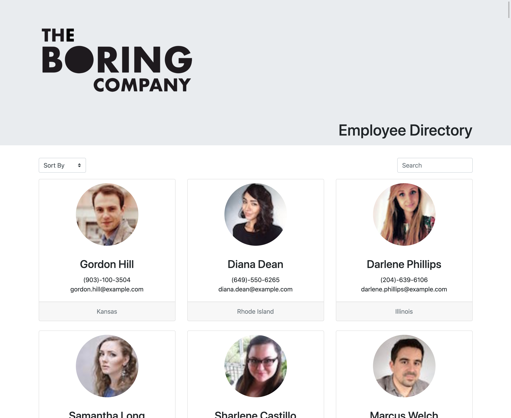

# Employee-Directory

A simple browser based employee directory that can be viewed, sorted, and filtered by a user.



### User Story

```
AS A user
I WANT to be able to view an entire employee directory at once
SO THAT I have quick access to employee information
```

### Acceptance Criteria

```
GIVEN a list of employees with employee data
WHEN the user loads the page
THEN a table of employees should render

WHEN the user selects a sort option
THEN the table will display the employees sorted by the selected category

WHEN the user types in the search field
THEN the table will display only the employees meeting the filter criteria
```

### Technologies

- HTML
- CSS and Bootstrap for repsonsive design
- React.js framework
- Random User API: https://randomuser.me/

# Application Usage

### Browser

https://ingridhoffman.github.io/Employee-Directory/

### Install

Download application package and open folder in Node.js

Install node dependencies:

```
npm install
```

Start the application:

```
npm run start
```

# License

MIT © Ingrid Hoffman
